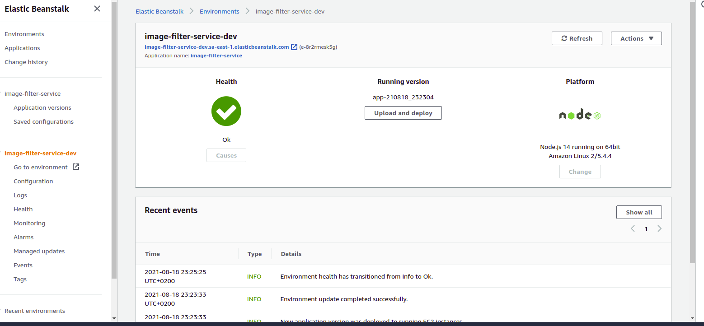

# Udagram Image Filtering Microservice

- Udagram is a simple cloud application developed alongside the Udacity Cloud Engineering Nanodegree. It allows users to register and log into a web client, post photos to the feed, and process photos using an image filtering microservice.

- In this project, I developed a simple image filter microservice to be integrated with the Udagram application

The project is split into three parts:
1. [The Simple Frontend](https://github.com/udacity/cloud-developer/tree/master/course-02/exercises/udacity-c2-frontend)
A basic Ionic client web application which consumes the RestAPI Backend. [Covered in the course]
2. [The RestAPI Backend](https://github.com/udacity/cloud-developer/tree/master/course-02/exercises/udacity-c2-restapi), a Node-Express server which can be deployed to a cloud service. [Covered in the course]
3. [The Image Filtering Microservice](https://github.com/mahmoud-sharshar/image-filter-microservice), the final project for the course. It is a Node-Express application which runs a simple script to process images.

### Setup Node Environment

You'll need to create a new node server. Open a new terminal within the project directory and run:

1. Initialize a new project: `npm i`
2. run the development server with `npm run dev`

### Deploying the Microservice

- The image filter microservice is deployed to *AWS Elastic Beanstalk*.
- The service is available at http://image-filter-service-dev.sa-east-1.elasticbeanstalk.com/
- There are two basic endpoints in the service:
    - Root endpoint `Get /`
    - Filter image endpoint `Get /filteredimage?image_url={valid image_url}`
    - Example: `http://image-filter-service-dev.sa-east-1.elasticbeanstalk.com/filteredimage?image_url=https://images.pexels.com/photos/298842/pexels-photo-298842.jpeg`

### Elastic Beanstalk Instance

